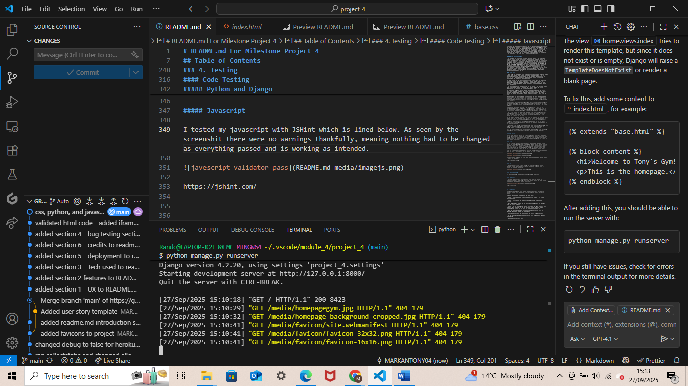

# README.md For Milestone Project 4

The purpose of this project was to create a fictitious gym website to demonstrate my proficiency in Python, Django, stripe, and other skills that I have developed on my diploma in web development with code institute.

## Table of Contents

### 1. UX

•	Project Goals

•	Developer and Business Goals

•	User Goals

•	User Stories

•	Wireframes

### 2. Features

•	Existing Features

•	Features Left to Implement

### 3. Technologies Used

•	Github

•	Bootstrap

•	Chrome Dev Tools

•	Stripe, Amazon Web Services (AWS), Python, Django, JavaScript, HTML5, & CSS3

•	Visual Studio Code

•	Microsoft Copilot

### 4. Testing

•	Bug fixes

•	Code Testing

•	Lighthouse

•	Story Testing

•	Functionality Testing

### 5. Deployment

•	How I deployed the project

•	How to clone this project

### 6. Credits

•	Credits to those who've helped the creation of this project

### 1. UX

##### Project Goals

The goal of this project was to create a full stack gym website with payment methods to demonstrate the skills and knowledge I have learned and used over the final module in the diploma I am studying. This is to show that I have the skills, knowledge and experience of a Junior Software Developer in working with HTML5, CSS3, Bootstrap, JavaScript, Python, Django, Stripe, and other technologies, with the hope of one day gaining employment within this growing and impactful industry.

##### Developer and Business Goals

The business/developer goal of this gym website is to increase sales for their gym business. By creating a website for the gym, this would advertise the gym on the internet to help gain traction to increase sales. Furthermore, describing the equipment available with costs and descriptions of all the services on offer will help to gain traction within the community, persuading people to exercise in this establishment to create a successful business by allowing people to purchase gym subscriptions online.

#### User Goals

The user goal for this site is to have a clear purpose for the site, see what gym
services they have available with appropriate descriptions. Users will also want to purchase different services from the gym, including monthly gym subscriptions,
along with other services including meal plans and classes. Easy navigation, along
with good UX principles are also required to provide a great user experience for the site’s users.

#### User Stories

Here is a link to all the information about the user stories used in this project, I recommend checking it out to see the full picture of which features were added and why. It is available to the public, meaning anyone with access to this link should in turn be able to access these user stories:

[https://github.com/MARKANTONY04/project_4/issues] 

However, here is a summary of them below (in no particular order):

1. Page Layout

As someone who is unfamiliar with technology, computers, and the internet, I want
the page format to be in a standard page layout that includes a navbar, body, and
footer on each page that will allow me to easily be able to navigate this website.

2. Extensive Services

As a fitness enthusiast, I want to be able to see the all of the gym’s services on a single page, including gym subscriptions, gym classes, and nutrition guides so I can see a varied choice of services and know what I want to purchase.

3. Add to bag feature

As an avid shopper, I want to be able to shop on the go add purchases that I think I’ll want to buy to a bag, so by the time I get to checkout I can purchase everything I’ve selected at the same time.

4. Edit bag feature

As an excited shopper, I want to be able to edit, add and remove the purchases I add to my bag as I often add things I don’t need and want to increase the quantity of items I purchase, as well as the total cost.

5. Checkout feature

As an avid online shopper, I want a fully functioning checkout system, displaying the items I’ve places in my bag, allowing me to edit my order and display the total cost.

6. Services information

As a potential user of this establishment, I want to be able to see the price and
descriptions of all services this establishment offers so I can see if it’s right for me.

7. Home page

As a user who’s unaware of this establishment, I want to see the purpose of this
website on the home/welcoming page to understand the point of this website and
how it applies to me, the user.

8. Contact Details

As a user wishing to question the owner beforehand, I want a contact section with
the establishments contact details in the website’s footer so I can contact the
owner easily.

9. Location

As someone who’s new to the area and wanting to find a local gym, I want to see
the address on the website with a google maps map showing the location.

10. Pictures

As a gym enthusiast, I want to see pictures of this gym so I can know if it’s
facilities suit me.

##### Wireframes

Wireframes were used in the preparation of this project to help create the layout of the website that acted as a guide once I had commenced coding. These wireframes
were created in the inception phase of this project, as I was planning out ideas. They are seen here and include the home, bag, services, and checkout pages on mobile and desktop:

a

a

a

This section was written before and in the early stages of this project in a Microsoft Word document and copy and pasted into the read me near the end of the project.

### 2. Features

##### Existing Features

At the conclusion of this project, this website is fully functioning and has all of the necessary features that a fully functioning gym website would need, and the features that were set out in the user stories section.

This website is fully responsive, and designed to look good regardless of what
screen size is being used. A mobile-first approach was used when designing this website as this is the most popular device size that is currently used when surfing the internet and browsing websites, and screen size was upscaled from there and designed in a way that would make it look good on larger screens with the use of bootstrap’s column function. The site looks good on any device, with content shifting to appropriate locations on the screen as the screen size changes, providing a great user experience.

This website is easy to navigate, as it is constructed in a way that users would
expect. There is a navbar at the top with working links to each of the page’s users may wish to visit, reinforcing a sense of familiarity and adding an expected page structure that users expect, making it familiar and easy to navigate. The main content in the page is arranged in a way that makes sense and allows easy manoeuvring. Buttons have also been placed on all pages, prompting users to move throughout the website and order the service they desire, that request then moves to the bag, which in turn moves the user to the checkout, which then confirms their order. Prices and descriptions are provided for service items, encouraging users to purchase a service this establishment offers.

The title of the gym is in the navbar that displays the business' name, sat in a clean and professional white emphasising the dedication and professionalism of this gym, and it is located at the top of the page regardless of screen size for all users to see.

Furthermore, there is a welcome message on the home page to greet the user as
they enter the site, explaining the purpose of the site and how it can be used to
benefit them and meet any potential user needs.

This gym website is user friendly, allowing users read the home page to get a sense of the website’s purpose, naturally taking them to the services page to gain an interest in purchasing the gym’s services as they see the services on offer that can benefit their lives. This carries them along to the bag page where users view their order and then proceed to checkout to complete this order, which will be confirmed by the purchase success page, providing them with their purchase details. A button then invites them to return home where they can navigate back to the home page of the website, allowing users to make another purchase if they wish.

There is a footer on the page that contains the site owner's contact information. It contains an email address, allowing anyone to easily contact the site owner for any requests, and it also contains social media links linking users to the site's social media pages to follow for any future updates to the site. There is also a google maps map to display the location of the gym if they wish to visit in person.

##### Features left to implement

Due to time constraints, there is a certain could-have priority level features in the user stories section that was unable to be implemented into the project. Though unfortunate, this is not a significant issue as the priority and usefulness of these features was low and the website is still fully functioning and finished without them.

As the time is now over to work on this project, I would have liked to implement a
merge bag feature when a guest would log in and become a user but unfortunately I
ran out of time focusing on other areas of the project and had to leave it out as a result. It is a shame as the feature is almost complete as you can see in the bag app, this will be something to come back to and finish.

Adding images to the site to display the Gym would have been useful but I had
unfortunately run out of time, this does not detract from the site however.
Ideally, this would have been a great addition to the site, enhancing its usability even further. However, the lack of these features do not detract anything from the site as the purpose of this site is to display the Tony’s Gym and allow users to make a purchase, therefore it’s purpose overall is fully met.

### 3. Technologies Used

For the creation of this website many technologies were used and utilised to bring
about the end result. First of all was Git hub, the site you are probably using to view this project and README.md. The code and supporting documents were written and added to Git hub, then committed with a commit message, and then finally pushed.

The project/issues section was also utilised to arrange the user stories to monitor progress and provide insight and information on what to do next. Markup language has also been used to write up this README.md file.

Drawn out Wireframes were also used as previously seen, as well as jotting down
useful points in the early stages of this project. Though the end result is a little different to what was originally conceptualised, these provided a useful instruction to begin constructing the page structure.

An instrumental tool that was used in this project was Bootstrap Version 4. The
navbar, and buttons, were all used from bootstrap. This allowed a more efficient
development time as I was able to copy the code from the website and implement it
into the html files and spend more time fixing bugs. Therefore, I would like to
personally thank Bootstrap for its free services, allowing me to use its code for my project.

Developer Tools on Google Chrome was also a useful tool that was used in the
creation on this website. It was instrumental in getting the website to be fully
responsive, as using it I could locate where bugs were causing issues and what the
bugs were, and allowed me to test to see if the site fitted correctly onto each screen size with its responsive design feature. As of writing this I have yet to test the website with lighthouse, however the lighthouse tool in Google Chrome dev kit will be used to test this website in the next section of this README.md.

Django, Python, JavaScript, HTML5, and CSS3 were all used to code, and therefore
create this website. Emmet abbreviation from GitHub to code in this was a very
useful feature, as this assisted me in coding, decreasing the time spent to write out full blocks of code, allowing me to focus my attention elsewhere. Emmet
abbreviation, along with GitHub copilot helped me some write large sections of code quickly as noted in the code files. Stripe was also used in this project to manage payments in the checkout section.

The web deployment site Heroku was also used in the creation of this project, where I was able to successfully deploy this project to the web. More info on deployment and cloning below in section 5 of this README.md. 

I would also like to thank Code Institute for teaching me on how to code in Django
and Python, and on how to use many of the tools listed above. There work on
previous projects has helped me carve out ideas for myself and use them in the
creation of this website, and as already noted.

Chat GPT also assisted me in fixing some of the bugs that are noted down in the
next section. Furthermore the code institute's tutoring service also assisted in solving bugs. Code institute's Django Blog and Boutique ado projects were useful
walkthroughs, inspiring me to come up with my own ideas for this project.

I used Microsoft Copilot to autofill the services sections with snazzy names and
descriptions for the services page, saving me a lot of time to focus elsewhere such as fixing bugs.

### 4. Testing

#### Bug Fixes

I encountered many bugs during the course of this project, both minor and major. I
fixed several myself but for some of the major bugs I used Chat GPT which was a
great help and allowed me to fix bugs quicker allowing me to focus on other areas of my project instead of spending time fixing bugs. A list of these bugs and how I fixed them can be found below:

##### Major bugs

###### Bag app/page

I had originally planned to have a ‘merge bag’ feature on login, where the user’s bag would merge on log in to their account. After spending a lot of time on trying to get this feature to work unfortunately I was not able to do so because of the deadline and other priorities. I used AI tools like chat GPT to help get ideas on how to implement this feature, like adding in a context processor and the bag_utils.py file but alas to no avail. I also tried using a user_logged_in signal but still had trouble getting it to work due to errors and issues with other website features. You may be able to tell with the different commits that I had to redo the bag template, views, and context processor several times due to errors in the code. Often it was because I forgot the names of functions and other code snippets (rookie mistake, a lesson learned the hard way!). Thankfully, I was able to use AI in the Visual Studio Code application and Chat GPT to redo the views to finally get them to work with the rest of the app/website. When creating the checkout app I created extra fields linking with the bag app that I hadn’t originally created in the bag app. This created big problems. I had to migrate the new data/models into the database scheme which fixed this. This took a lot of work but Chat GPT walked me through this and I was able to fix this thankfully.

###### Checkout app/page

I also had some trouble with my checkout app to get it fully functioning by the end of the project. I had to rewrite/code the views a few times due to errors I was getting. I again used Chat GPT to find out where they were and correct them.
Seperating the webhooks from the views.py file into its own file brought lots of little bugs, like having to update the checkout urls, importing the views and so on but thankfully these were fixed quickly and easily. I had trouble implementing stripe into this project initially, using the command stripe login command caused a ‘max attemps reached’ bug that would not allow me to login and test for webhooks but this thread on github support showed me that by using the command ‘stripe login –interactive’ with the stripe secret key I could log in to stripe to test the webhooks to see if the checkout app worked as intended.

###### Heroku Deployment Database

I accidentally started this project using an sql database format that was not
compatible with Heroku. After creating the models in the apps and filling in the data for the services application, I deployed to Heroku only to be met with errors that the database was incompatible. To fix this problem I tried installing the Heroky CLI to no avail, I also tried fixing this with Heroku NPM also to no avail. At the end, I used the ‘dumpdata’ command to extract the data from the old sql database to migrate all of that data to the new database. I also received a UTF-8 error when trying to do this. Thankfully, with the help of Chat GPT I was able to amend the format to be compatible with python (UTF-8), which then transferred the data from the old database to with new database via json format. I had to try this a few times until I eventually found success.

###### Heroku Deployment – Bugs

I had many bugs and issues when trying to deploy to Heroku, I had to fix many
different bugs in my code (particularly settings.py) to work with Heroku. One example included using .parse instead of .config for the secret key as the string was causing an error. I also forgot to add the secret key to my Heroku project. I also had to receive assistance from the Code institute tutors on 1 occasion to help me fix a bug that stumped me. I forgot to set the SECRET_KEY, DATABASE_URL, API_KEY, and STRIPE_SECRET_KEY config vars on Heroku Lots of little bugs caused a
significant portion of my time to fix these to achieve a successful Heroku deployment for the project. This fixed the Heroku deployment error, but I was still receiving a Server error (500), after a 1 - 2 days I used Microsoft Copilot who suggested running ‘python manage.py collectstatic’ that fixed the issue thankfully. Getting a successful Heroku deployment was a huge headache but thankfully I got there in the end.

##### Minor bugs

I think my PC may have had an issue with the virtual environments in Visual Studio
Code as after setting up my virtual environment on the first day, I had to redownload the packages in requirements.txt the next day. Thankfully this was a quick fix and I resolved any errors that arose when running migrations by redownloading the packages in requirements.txt.

One of my classes for the services app was called ‘class’ which may have caused
issues when running the server. To fix this I renamed it from ‘Class’ to ‘Gymclass’ which worked. I had to change this in the views, models, and other places so I used AI/Chat GPT to help me locate each area where I had to change which helped a lot.

I had to rerun migrations in the services and bag apps as I had to change models
after creating them because I forgot to add a feature. Adding the quality (default = 1) and rerunning the migrations fixed this error.

For some reason my Python version changed before I first deployed the project (this could have been linked to the virtual environment issue mentioned above), resulting in a deployment error on Heroku. After realising that the Python version had changed, I changed it back to Python version 3.12.8 which fixed the error.

When I tried to run server and make migrations near the start of the project I
received an error in the terminal. This is because I had missed a comma in the
‘installed apps’ (django.contrib.sites) in settings.py. Quickly adding the comma fixed this error.

When I tried to test the allauth login/logout feature, I had trouble testing this as I was already logged in. Thankfully Microsoft copilot spotted this for me so I was able to notice and fix this as I was quite stuck, not realising I was already logged in!

Like Boutique ado, I used bootstrap 4 for this project so I could use the boutique ado project as a template if I ever got stuck. I received an error in the mobile navbar expanding error when tapping the burger icon. Simply deleting that section of code and repasting it from bootstrap thankfully fixed the error.

I had a wrong link in the navbar that caused an error when running the server.
Changing the services url to  managed to fix this issue at that’s what linked with the view that was already created. I also amended the project’s URL for this.

You may be able to see an excess of other files and commented out code that wasn’t
removed until the end as I used these to test the project as I was building it. This helped to test features while being built to see if they worked properly.

I forgot to link the CSS file in the project and wondered why the CSS wasn’t working. After realising the CSS link wasn’t in the base HTML file I added it in and resolved the issue.

I received an error message once I added crispy forms into the login/out page as I
forgot to download the package on Visual Studio Code. Once I downloaded the
package because of the prompt on the terminal the issue had resolved.

There was an invalid map filter on the checkout page causing an error on loading,
removing this filter fixed the error allowing successful stripe page load.

#### Code Testing

Testing is an important part of any project, especially in software development and web applications to ensure that the site/project is working as intended with no bugs interfering with the user experience. The HTML, CSS, and Python/Django were all tested and verified for this project, demonstrating that the project is fully working as intended.

##### HTML

All the HTML code passed through the industry recognised W3 Validator (linked below). Due to using Django, some errors popped up when testing my code with the validator as seen below as the validator is not used to Django template code (url links etc). Therefore I removed all incompatible code with the validator and thankfully the code was tested and passed through the validator as seen below demonstrating that this project has met the HTML requirements as seen below.

Also, the iframe element had a width = '100%', an incompatible value therefore I added the width = 100% class to css and gave it the class '.iframe'

This was the base template, the other pages were checked and alos passed. Here is a link to the validator:

https://validator.w3.org/

##### CSS

I passed the CSS for this project through the industry recognised W3 CSS validator (linked below) and after removing unused CSS, it passed first try without any issues as seen below.

##### Python and Django

All Python and Django code was written using the pep8 guidelines.

##### Javascript

I tested my javascript with JSHint which is lined below. As seen by the screenshit there were no warnings thankfully, meaning nothing had to be changed as everything passed and is working as intended.

https://jshint.com/

#### Lighthouse

Using Chrome Dev Tools, I was able to use the Lighthouse tool to test the reliability and functionality of the website from a user end point of view. I decided to use incognito mode to run the test as this blocks web extensions that can falsely hinder results. After first running the test, here are the results I received:

Overall great results. All are in the high 80's or 90's

This image shows that bootstrap and the font i'm using is dectrasing the perfrmance to a score of 85/100. As this is a high score I will keep bootstrap as it's findamntal to the fromt end and I'll keep the font as it's bold style suits the site well and the imapct of these is minimal as the score is still high.

Accessability scored a high score of 89, a suggestion was made to add an aria label as seen above. I then added the aria-label to mitigate this error. Another suggestion was to increase the contrast in the background color. I left the color as it was as any darker would intefer with some text, and it wasn't a big issue as the score was high (89) meaning it would't pose a significant issue to users.

Best practice scored a high score of 96. The suggestion was to fix an image that wasn't loading properly. I decided to remove this image from the site as it was unecessary. This is a high score showing this site follows all web development best practices.

#### Story Testing

This section will look back onto the user stories to show how the end result has met the 'must-have' and 'should-have' user stories criteria.

Page Layout - This user story has been fully met as the site is responsive and traditionally structured, allowing a familiar layout that any user can appreciate. With a navbar at the top of the page guiding users through the site and helping them navigate to a page they want. The content of the page is well structured regardless of the screen size of user devices, and there is a footer at the bottom of the page to prompt contact if required.

Extensive services - This user story has been met as there is a page dedicated to displaying the vast variety of services this establishment has on offer for users.

Add to bag - This has been met as a dedicated bag app/page allows user to add services to a bag to purchase.

Edit bag - Met as users can edit quantities and remove items completely from their bag

Checkout - Checkout app and page allowing users to purchase services with a confiormation page means this story is fully met

Home page - Dedicated home page on site start up showing purpose of site to users means this user story has been fully met.

Contact details - Footer on every page displays various contact details to all users proving this has been met.

Location - Map in the footer shows gym location to all users meaning this has been met.

Pictures - This has not been met as there are no pictures on the site. However, this is only a 'could have' feature and does not detract from the value of the site in any way as users can quickly understand the purpose of the site, easily navigate through it to view services, edit in the bag, and make a purchase in the checkout. Fully fledged titles and descriptions about the gym and it's services provide users with the information they need.

All of this shows that the necessary user stories have been met for this project. 

Here is a link to the user stories section if you wish to visit it for yourself:

https://github.com/MARKANTONY04/project_4/issues

#### Functionality Testing

This section will document the testing the website will undergo to ensure everything about the website is working as it should be. A table is below noting the action to test, the expected behaviour, and whether or not it passes or fails.

| Action        | Expected behaviour  | Pass/Fail|
| ------------- |:-------------:| -----:|
| Click all navbar items on every page to test if the links work | Navbar link takes you to expected page | Pass |
| Click on the navigation buttons on each page of the site that takes you to the expected page/ location| Button links takes you to expected page | Pass|
| Clicking on each services 'add to bag' item add's it to bag  | Clicked on item is added to bag| Pass|
| User is able to edit bag by increasing, decreasing, and removing items from bag with appropriate buttons.  | Increase, decrease, and remove buttons perform appropriate actions | Pass|
| Clicking on 'back to top button' (bottom right) | Takes you back to the top of the page | Pass|
| All fields on the registarion form filled| User is required to verify email | Pass|
| User verifies email on account creation| User account is created and taken back to site | Pass|
| One or more field(s) on the registarion form not filled| Warning is given to fields not filled | Pass|
| Stripe purchase checkout form filled in | Order confirmation screen is shown| Pass|
| Stripe purchase checkout form not fully filled in | Error displays asking to fill in field(s) | Pass|
| User clicks back arrow on stripe purchase checkout page  | Order cancelled page shows directing user back to site | Pass|
| Users can purchase items without account | Purchases are registered and payment is confirmed | Pass|
| Users can purchase items with account | Purchases are registered and payment is confirmed | Pass|
| Deploy in Heroku | Successful deployment shows everything working as it should like local environment| Pass|

### 5. Deployment

This project was deployed using Heroku. Code was committed to git, and then
pushed to GitHub, which Heroku then procured the pushed code to deploy this
project.

To deploy this project, please follow the steps below:

1. Create a ‘requirement.txt’ file using the terminal command ‘ pip freeze 
requirements.txt’.

2. Create a Procfile with the terminal command ‘echo web: python app.py 
procfile’.

3. ‘git add’ and ‘git commit’ the new requirements and Procfile and then ’git push’ the project to GitHub.

4. Create a new app on the Heroku website by clicking the ‘New’ button in your
dashboard. Give it a name and set the region to Europe. (You will need to
create a Heroku account and log in if you have not already done so).

5. From the Heroku dashboard of your newly created application, click on
‘Deploy’, ‘Deployment Method’ and select GitHub.

6. Confirm the linking of the Heroku app to the correct GitHub repository.

7. In the Heroku dashboard for the application, click on ‘Settings’, ‘Reveal
Config Vars’.

8. Set the following config vars:

(Key – Value)

Debug – False

IP – 0.0.0.0

MONGO_URI – mongodb+srv://:@cluster_name-
qtxun.mongodb.net/database_name?retryWrites=true~=majority

PORT – 5000

SECRET_KEY – your_secret_key

To get your MONGO_URI, read the MongoDB Atlas documentation on the official
website. (Here: https://www.mongodb.com/docs/)

9. In the Heroku dashboard, click ‘Deploy’.

10. In the ‘Manual Deployment’ section of this page, make sure the master branch
is selected and then click ‘Deploy Branch’.

11. The site is now successfully deployed.

At the moment of submitting this milestone project, the Development Branch and the
Master Branch are identical.

How to run this project locally in your IDE (VS Code, PyCharm etc)
To clone this project from GitHub:

1. Follow this link to the Project GitHub repository:

https://github.com/MARKANTONY04/project_4

2. Under the repository name, click clone or download (click the green code
button for dropdown).

3. In the clone with HTTPs section, copy the clone URL for the repository.

4. In your local IDE open Git Bash

5. Change the current working directory to the location where you want the
cloned directory to be made

6. Type git clone, and then paste the URL you copied in step 3

7. Press enter, your local clone will be created

You will need a GitHub account and the chrome browser for this.

Here is the GitHub guide for cloning repositories:

https://pages.github.com/

This project was deployed early in development as per good software development
practice to help spot bugs as they appeared on a real website and not just a
developer environment. Overall, the deployment of this website was a smooth
experience, with no issues flagging up as a result.

### 6. Credits

Firstly, I would like to thank my mentor for helping me with ideas for projects and good software development on this course.

I would also like to thank the free technologies that I have been able to use for this project, I will once again mention Bootstrap, GitHub, Visual Studio Code, Chat GPT and Slack for all of these tools that have helped made coding this project possible.

I would also like to mention that I used the README.md from my last project with
Code institute as a template for this README.md. Like all good software developers,it's good to reuse code (and other things) when appropriate to do so to save time, allowing me to direct my attention elsewhere.

I would like to thank W3 as I learned some of the CSS I used for this project,
underline text in particular.

Also I’d again like to thank chat GPT who helped me create this project. I live a busy life with a full time job and personal commitments, the time I have available to work on this can sometimes be limited so utilising AI in the age of AI was a smart way to help me get this project done on time. You can see on some of the templates and views in this project I used Chat GPT to fix major issues by rewriting code with errors (in the views), and also save time by generating some of the tables and other featutres in the tamplates (emoji's, the iframe map, the checkout and bag javascript in the script tags etc). It saved me time as it would have taken far longer if I had to do these myself, and am thankful for the time save it gave me.

Last, and certainly not least I would like to once again thank Code Institute. I havelearned backend end software/web development with Django in a matter of weeks
thank to them and would not have been able to create this project without them.
Furthermore, the walkthrough projects (Boutique Ado inspired this project’s base
template as you can probably see) throughout this module culminating in this project have been particularly useful. I would not be here without the teaching I have received from Code institute, and hope this project shows the skills I have learned,and now have been able to implement. 

